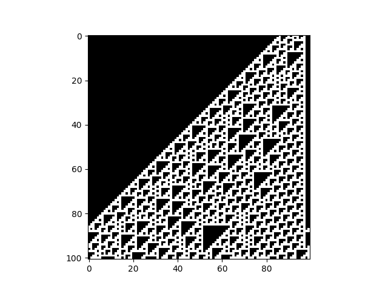
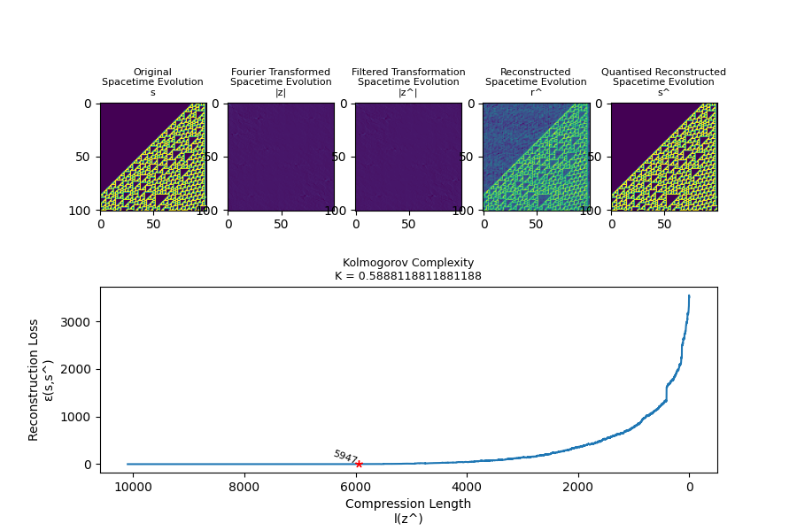
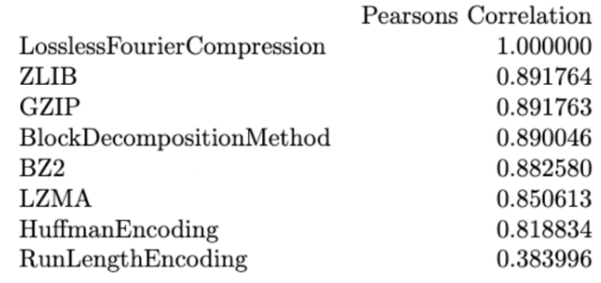

# 0. Install Dependencies
```
pip install eca
```
For a full list of dependencies, see `requiremeents.txt`

---

# 1. Generate Dataset
```
python generate_data.py
```
Generated spacetime evolutions will be stored in `data`

## View a generated spacetime
```python
from numpy import load
from matplotlib.pyplot import imshow, show

with open("data/rule110_ic8932_identity.npy", 'rb') as spacetime_file:
    spacetime_evolution=load(spacetime_file)

imshow(spacetime_evolution,cmap="gray")
show()
```


---

# 2. Measure Complexity of Dataset
```
python measure_complexity.py
```

Measured Complexities will be stored in `results`


## View novel metric on a specific spacetime
```python
from metrics.lossless_fourier_compression_metric import LosslessFourierCompression

LosslessFourierCompression(spacetime_evolution=spacetime_evolution,verbose=True)
```


---

# 3. Quality Evaluations of Metrics
```
python quality_evaluations.py
```

Evaluation results will be stored in `results`

---

# 4. Display Evaluation Summaries
```
python summarise_as_latex.py
```

```latex
\begin{tabular}{lrrrrrr}
 & identity & inversion & shift & rotation & reflection & total \\
RunLengthEncoding & 0.000000 & 0.000000 & 0.000968 & 0.227389 & 0.000770 & 0.229128 \\
Test & 0.000000 & 0.000000 & 0.000000 & 0.000000 & 0.000000 & 0.000000 \\
\end{tabular}
```

